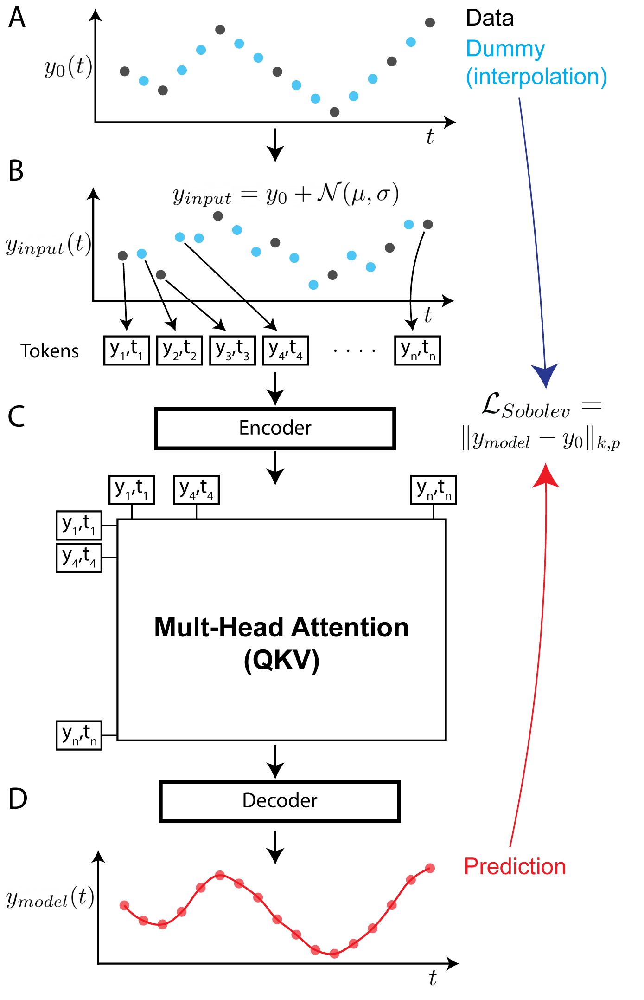

# Continuous Spatiotemporal Transformers

Pytorch implementation of the Continuous Spatiotemporal Transformers (CST)




# Quickstart
Clone this repository locally:

```
git clone https://github.com/ahof1704/CST.git
```


Create an Anaconda environment from the `cst.yml` file using:

```
conda env create --file cst.yml
conda activate cst
```


If you use CST or any part of it in your own work, please cite [Fonseca et al]([https://arxiv.org/abs/2206.14282](https://arxiv.org/abs/2301.13338)):
```
@article{fonseca2023continuous,
  title={Continuous Spatiotemporal Transformers},
  author={Fonseca, Antonio H de O and Zappala, Emanuele and Caro, Josue Ortega and van Dijk, David},
  journal={arXiv preprint arXiv:2301.13338},
  year={2023}
}
```

# Datasets

## Toy data 
The toy data has been obtained by solving analytical IDEs in 2D and 4Ds. The kernels used in both cases were convolutional kernels where the entries were given by combinations of trigonometric functions. The F function was a hyperbolic cosine. To obtain the datasets, we have randomly sampled initial conditions and solved the corresponding initial value problem for the IDEs, using our implementation of the IDE solver. The integrals have been performed with Monte-Carlo integration with 1K sampled points per interval, and the number of iterations used was set to 10, which was empirically seen to guarantee convergence to the solution.

The scripts for the toy data generation can be found [here](resources/NIDE_method_github.png).

# Tutorial
For an example on how to use CST to model dynamics, consult this [notebook](main-toyData.ipynb) in which CST is used to model the toy dataset described above.


# Manual Environment Creation
If the `cst.yml` file does not successfully recreate the environment for you, you can follow the below steps to install the major packages needed for this project:

1. Create and activate an anaconda environment with Python version 3.8:
```
conda create -n cst python=3.8
conda activate cst
```

2. Install Pytorch: `conda install pytorch==1.12.0 torchvision==0.13.0 cudatoolkit=11.3 -c pytorch`

3. Install Matplotlib: `conda install -c conda-forge matplotlib`

4. Install `pip install git+https://github.com/patrick-kidger/torchcubicspline.git`

5. Install `conda install -c anaconda scipy`

6. Install `conda install -c conda-forge torchdiffeq`

7. Install `conda install -c conda-forge tqdm`

8. Install `conda install -c anaconda scikit-learn`


